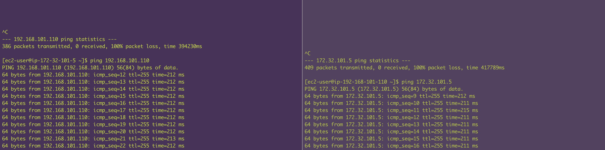

# Senario Brief

## In `Account A's us-east-1`, Create a VPC in and its state in `S3` in `us-east-1` region altogether

## In `Account B's ap-southeast-1`, Create a VPC in and its state in `S3` in `ap-southeast-1` region altogether

## Create a `PCX` by replacing `tfvars` and other necessary values
_____________________________________________________________________________
_____________________________________________________________________________
## AWS profile configuration

> vi ~/.aws/config
```
[profile acc_a]
region = us-east-1
[profile acc_b]
region = ap-southeast-1
```
> vi ~/.aws/credential
```
[acc_a]
aws_access_key_id = AKIAacvalksre;jf;awkejASDFAWEF
aws_secret_access_key = Hwt1Daa;lsiejrf;a/lekjf;akeasdf
[acc_b]
aws_access_key_id = AKIA;lkajweroifjnaekl/fmnakwl
aws_secret_access_key = 9hOb6ka;oewjefa;oiwmf/aAGERRG
```

### Create ACC_A resources
> Terminal 1
```
cd terraform-aws-pcx/examples/vpcs
export AWS_PROFILE=acc_a
terraform init -backend-config=acc_a.conf -reconfigure
terraform plan -var-file=acc_a.tfvars -out=acc_a.plan
terraform apply acc_a.plan
```


### Create ACC_B resources
> Terminal 2
```
cd terraform-aws-pcx/examples/vpcs
export AWS_PROFILE=acc_b
terraform init -backend-config=acc_b.conf -reconfigure
terraform plan -var-file=acc_b.tfvars -out=acc_b.plan
terraform apply acc_b.plan
```

### Create PCX
> Terminal 3
```
cd terraform-aws-pcx/examples/
terraform apply
```


## Test connection

_____________________________________________________________________________
## Clean up!
### Destroy PCX
> Terminal 3
```
terraform destroy
```

### Destroy ACC_B resources
> Terminal 2
```
terraform init -backend-config=acc_b.conf -reconfigure
terraform destroy -var-file=acc_b.tfvars
```

### Destroy ACC_A resources
> Terminal 1
```
terraform init -backend-config=acc_a.conf -reconfigure
terraform destroy --var-file=acc_a.tfvars
```
